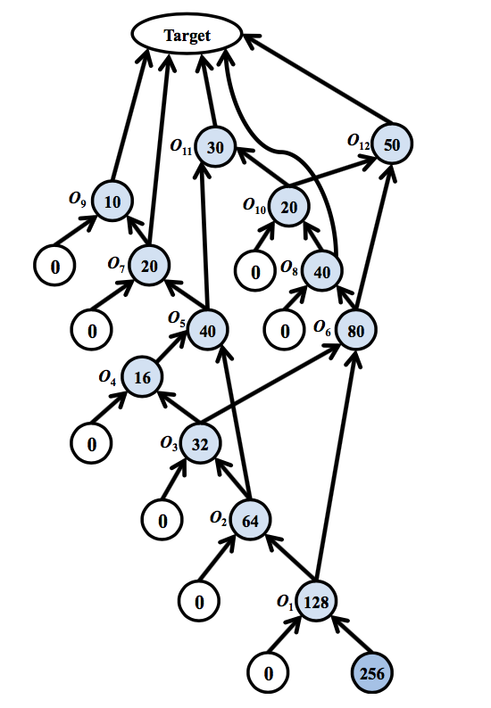
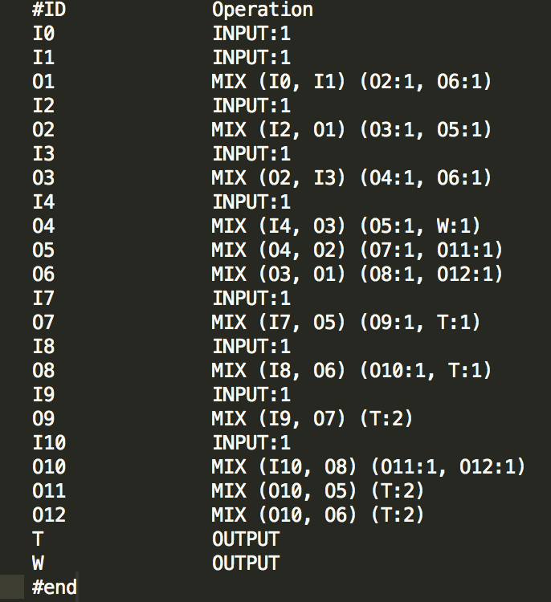
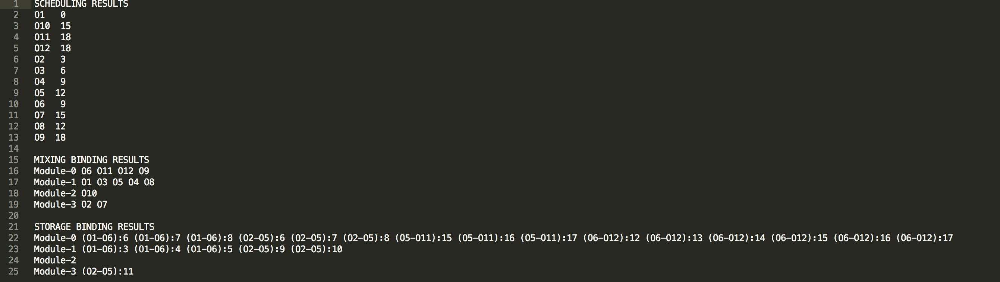
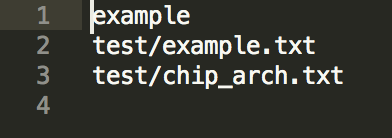

# Bio-Chip Scheduling
<a href="http://www.ngc.is.ritsumei.ac.jp"></a>

This is a tool for biochip researchers to find out the optimal scheduling results for any dilution graph they are working with. The input to the program is a specification of the dilution graph and the architecture of the biochip. The code is the implementation of <a href="http://ieeexplore.ieee.org/abstract/document/7434979/">this</a> paper from VLSID'16 conference. A reading of the paper would be helpful in understanding and modifying the source code.



<BR CLEAR="all">

A sample input for the chip architecture can be found in `test/chip_arch.txt` and more input dilution graph examples can be found as `*.txt` files in `test/` directory. The final output of the program is the binding and scheduling result of the given diultion graph on the specified chip architecture.


<BR CLEAR="all">

## Interpretting the Results
The `SCHDEULING RESULTS` describe at which time step an operation got scheduled on the bio-chip. In the above example, the operation time is selected to be 3 time steps. `011   15` means that operation 11 got scheduled at time step 15. The `MIXING BINDING RESULTS` describe which module carried out a certain operation. `Module-0 O6 O11 O12 O9` means that operation 6, 11, 12 and 9 were done on module-0. The `STORAGE BINDING RESULTS` describe which module was responsible for storage of a droplet as it waited for the next operation to happen. `Module-3 (O2-O5):11` means that module-3 stored the droplet from operation 2 to operation 5 at time step 11. 

## Getting Started

These instructions will get you a copy of the project up and running on your local machine for development and testing purposes. You will need to have CPLEX software installed on your system in order to run the program.

### Parser and Code Generator

The first component of the program is a file parser and code generator **PCG**. This program takes the dilution graph and chip architecture as input and produces the code that we need to run on a CPLEX solver in order to get the results as described above. Run the following command to build the parser:
```sh
$ make bin/parser
```


The binary `bin/parser` takes three inputs:
1. Name of the generated code file
2. Dilution graph specification
3. Chip Architecture specification

Sample input files can be found in `test/` directory as `*.ip` files. From the main directory of project, an example instantiotion of the PCG would look as follows:
```sh
$ bin/parser < test/brad.ip
```
This would produce a file `src/cplex/brad.cpp`. Compile this file using the following command:
```sh
$ cd src/cplex/
$ make FOO=../../build/brad.o
```
This would create a file `/bin/run`. Note that `/` means the main directory of the project. From within the `/src/cplex/` directory, run the following command:
```sh
$ ../../bin/run
```


